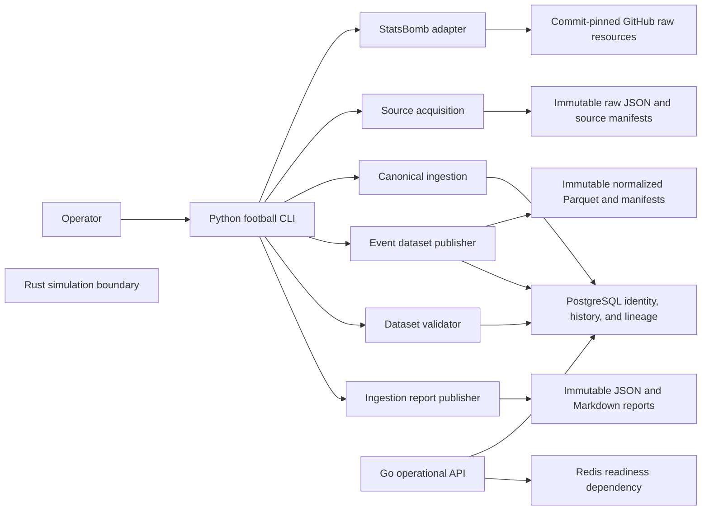

# Sprint 1 architecture

## Status and scope

Sprint 1 implements the reproducible football data foundation. It acquires commit-pinned StatsBomb Open Data, preserves raw bytes, publishes provider-neutral canonical identities and temporal observations in PostgreSQL, stores normalized events as Parquet, validates datasets, and publishes immutable ingestion reports.

Forecasting, feature generation, model training, football simulation, prediction APIs, background jobs, 360 normalization, and object storage are outside this boundary.

## System context



Python owns data acquisition, canonical ingestion, normalization, validation, and reporting. Go currently owns only `/healthz`, `/readyz`, `/version`, and graceful HTTP lifecycle. Rust currently owns only the dependency-free deterministic seed boundary for the future simulator.

## Python component boundaries

Dependencies point inward toward contracts and immutable storage primitives:

```text
football.providers   → provider resource descriptors and bounded HTTP fetches
football.ingestion   → immutable acquisition, verification, registration, canonical writes
football.datasets    → normalized event Parquet and dataset registration
football.validation  → policy-driven dataset checks and immutable findings
football.reports     → deterministic JSON and Markdown evidence publication
football.forecasting → deterministic team models and immutable model history
football.cli         → command parsing, configuration, orchestration, exit behavior
```

The CLI contains no duplicate domain parser or normalizer. It composes production services and uses PostgreSQL mappings and observations to resolve a provider season and its matches.

## Command flows

### `football ingest competitions`

```text
validate pinned source configuration
→ acquire competitions.json
→ verify immutable source manifest and bytes
→ register source scope
→ ingest canonical competitions and seasons
→ publish IngestionReportV1 JSON and Markdown
```

### `football ingest season <id> [--competition-id <id>]`

```text
validate source and quality-policy configuration
→ acquire and ingest competition catalog
→ resolve exactly one provider competition for season, or use the explicit pair
→ acquire and ingest season match list
→ supplement a catalog-missing pair from consistent match-list metadata with source lineage
→ resolve match IDs from that exact source snapshot
→ acquire and ingest every lineup and event resource
→ publish normalized event Parquet and dataset manifest
→ register dataset lineage
→ validate dataset and register findings
→ publish IngestionReportV1 JSON and Markdown
```

The catalog, match-list, and detail acquisitions are separate immutable source scopes at one provider Git revision. They are intentionally recoverable units, not one distributed transaction. If a later step fails, an identical command verifies completed scopes and resumes from the first missing step. An explicit competition ID is required when a season ID is ambiguous or the pinned catalog omits the requested pair. In that catalog-missing case, the parser accepts only internally consistent competition and season metadata from the preserved match list, records that resource as lineage, and leaves authoritative raw bytes unchanged.

### `football validate season <id>`

The command resolves exactly one current canonical mapping for the provider season, selects its latest published normalized event dataset, verifies its registered files, applies the checked-in quality policy, and idempotently registers or verifies the deterministic validation run.

## Storage ownership

| Store | Owns | Does not own |
| --- | --- | --- |
| PostgreSQL | Provider namespaces, source registration, canonical UUIDs, provider mappings, temporal observations, lineups, event catalogue, dataset registry, validation runs and findings | Raw provider payloads, full analytical event facts, report bodies |
| Local immutable filesystem | Raw provider bytes, source manifests, Parquet files, dataset manifests, JSON and Markdown ingestion reports | Relational identity and temporal query state |
| Redis | Local operational readiness dependency | Sprint 1 data or prediction truth |

The local filesystem is the first immutable artifact-store implementation. A future S3-compatible adapter must preserve path safety, checksums, exclusive publication, retry, and conflict behavior.

## Identity, time, and lineage

Canonical competition, season, team, player, match, and event UUIDs are provider-neutral. Provider IDs remain in mappings and observations. One source snapshot identifies one manifest scope at one provider revision; every observation references the exact source resource that supplied it.

System-knowledge intervals use half-open `[known_from, known_to)` ranges. Backtests must use explicit point-in-time queries through `PointInTimeRepository`; current views are operational conveniences and must not become modelling inputs.

Dataset lineage is bidirectional:

```text
source snapshot → source resources → dataset inputs → dataset version → dataset files
dataset file → dataset version → source snapshot/resources → canonical event/match
```

Composite foreign keys prevent cross-snapshot resources and cross-dataset files from being attached to findings or datasets.

## Immutability, idempotency, and recovery

- Provider access requires a full lowercase 40-character Git SHA.
- Raw resources, manifests, Parquet, and reports use exclusive writes; existing different bytes fail closed.
- Source, dataset, validation, and report identities are deterministic from immutable inputs and versioned contracts.
- Identical completed acquisition reruns verify local checksums without network access.
- Canonical writes for one source scope are transactional.
- Parquet publication precedes PostgreSQL dataset registration; a retry reconciles valid orphaned files after database rollback.
- Report publication follows validation; a retry verifies an already published JSON or Markdown artifact and completes any missing counterpart.

PostgreSQL advisory locks serialize canonical identity, dataset, and validation publication. Provider mapping exclusion constraints protect first-seen canonical identity under concurrency. Retryable serialization, deadlock, and exclusion outcomes abort the whole canonical scope rather than publishing partial identity state.

## Quality model

`schemas/quality/statsbomb-quality-policy-v1.json` maps stable rule codes to severity and action. Status follows the strongest finding:

```text
FATAL       → failed
QUARANTINE  → quarantined
WARNING     → warnings
INFO/none   → passed
```

Provider anomalies remain preserved when safe. Warnings identify excluded derived features; quarantine identifies data that downstream modelling must not consume. Validation never rewrites raw or normalized artifacts.

## Security and configuration

- Provider URLs are generated only from the fixed StatsBomb repository, pinned revision, and validated resource paths.
- HTTP reads have a 60-second timeout and 128 MiB resource limit.
- Manifest and raw reads are bounded, checksum-verified, regular-file-only, and constrained beneath the configured data root.
- PostgreSQL and Redis Compose ports bind to loopback.
- Database credentials and source revisions come from CLI options or environment; no secrets are stored in reports.
- Public CLI database errors omit connection details.
- Production migrations are forward-only and owned exclusively by `infrastructure/migrations`.

## Verification boundary

`make check` runs Python formatting, Ruff, strict MyPy, Python tests, Rust formatting/lint/tests/build, Go vet/lint/tests/build, migration validation, shell syntax checks, and wheel/sdist builds.

`make integration` builds artifacts, starts pinned PostgreSQL and Redis containers, migrates a fresh temporary database twice, runs storage and CLI integration tests, and checks the Go operational API. Committed synthetic fixtures cover passed, quarantined, malformed, and idempotent paths without network access.

## Detailed references

- [Source acquisition](source-acquisition.md)
- [Canonical data model](data-model.md)
- [Temporal model](temporal-model.md)
- [Canonical ingestion](canonical-ingestion.md)
- [Normalized event datasets](event-datasets.md)
- [Data validation](data-validation.md)
- [Ingestion reports](ingestion-reports.md)
- [CLI](cli.md)
- [Team Elo baseline](team-elo.md)
- [Dixon–Coles goal baseline](dixon-coles.md)
- [Corner count baselines](corner-models.md)
- [Sprint 2 backtesting](backtesting.md)
- [Model governance](model-governance.md)
- [Sprint 2 phase gate](sprint2-phase-gate.md)
- [ADR 0001: Python managed runtime pin](adr/0001-python-managed-runtime-pin.md)
- [ADR 0002: Go analysis scope](adr/0002-go-127-golangci-analysis-scope.md)
- [ADR 0003: Commit-pinned source acquisition](adr/0003-use-commit-pinned-source-acquisition.md)

## Deferred boundaries

Sprint 2 baseline, walk-forward, calibration, artifact, forecast, evaluation, and governance contracts are implemented. `make sprint2-evaluate` retains JSON and Markdown evidence at the first blocking gate stage. The approved EPL 2015/16 corpus contains 380 matches and 1,313,773 normalized events. Contradictory player facts retain exact variants; validator v3 records 749 warnings and no quarantine findings. A separate versioned claim binds every completed lifecycle assertion to exact score-reconciled match, event-resource, dataset-file, and validation evidence without mutating raw provider status. The gate now reports 380 registered, 380 completed, and 380 scored targets, then remains `FAIL` at `walk-forward-execution` because no complete retained chronological evaluation exists. No synthetic metrics are emitted. Player modelling and full Monte Carlo simulation remain blocked until Sprint 2 evaluation evidence is reviewed and passed.
