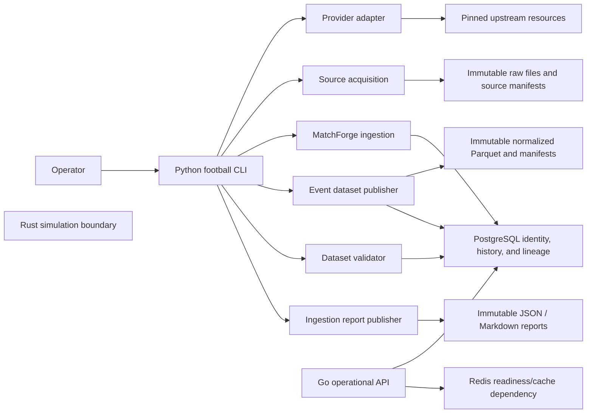

# MatchForge Data Platform Architecture

## Purpose

This document describes the implemented ingestion, identity, dataset-publication, validation, retry, and recovery architecture originally established during Sprint 1 and extended afterward.

For system-wide ownership and language boundaries, see [architecture.md](architecture.md).

This document intentionally avoids recording current Sprint/phase status, model-promotion state, target counts, or gate outcomes. Those belong in the repository's tracked project-status authority, Wayfinder decisions, and durable evidence.

## Scope

The data platform owns the reproducible football data foundation:

- commit-pinned provider acquisition;
- immutable raw bytes;
- provider-neutral MatchForge identity;
- temporal observations in PostgreSQL;
- normalized event datasets in Parquet;
- validation;
- immutable ingestion reports;
- dataset and source lineage;
- deterministic retry/recovery behavior.

Forecasting, model mathematics, simulation, and production serving are consumers of this foundation and are documented separately.

## System Context



Python owns data acquisition, MatchForge ingestion, normalization, validation, reporting, and provider synchronization workers.

Go may read registered operational state but must not reimplement football data or model logic.

Rust is outside the data-platform implementation boundary except where a future authorized simulation layer consumes published model inputs.

## Python Component Boundaries

Dependencies point inward toward contracts and immutable storage primitives:

```text
football.providers   → provider resource descriptors and bounded source fetches

football.ingestion   → immutable acquisition, verification,
                       registration, identity mapping, MatchForge writes

football.datasets    → normalized event Parquet and dataset registration

football.validation  → policy-driven dataset checks and immutable findings

football.reports     → deterministic JSON / Markdown evidence publication

football.forecasting → consumer of point-in-time MatchForge history

football.cli         → command parsing, configuration, orchestration,
                       exit behavior
```

The CLI contains no duplicate domain parser, identity resolver, or normalizer.

It composes production services and resolves provider resources through registered mappings and observations.

## Command Flows

The exact commands may evolve. These flows describe the durable behavior they must preserve.

### Competition Ingestion

```text
validate pinned source configuration
→ acquire competition resource
→ verify immutable manifest and bytes
→ register source scope
→ ingest MatchForge competitions and seasons
→ publish ingestion report
```

### Season Ingestion

```text
validate source and quality-policy configuration
→ acquire and ingest competition catalogue
→ resolve one provider competition/season pair
→ acquire and ingest match list
→ acquire required detail resources
→ ingest MatchForge identities and observations
→ publish normalized event Parquet and manifest
→ register dataset lineage
→ validate dataset and register findings
→ publish ingestion report
```

Catalogue, match-list, and detail acquisitions are separate immutable source scopes under one pinned provider revision.

They are intentionally recoverable units rather than one distributed transaction.

If a later step fails, an identical retry verifies completed scopes and resumes from the first incomplete step.

When a provider catalogue omits an otherwise valid pair, any fallback resolution must use preserved source evidence, remain deterministic, and retain exact source lineage. It must never rewrite raw provider bytes to make the catalogue appear complete.

### Dataset Validation

Validation resolves the intended registered dataset, verifies its files, applies the checked-in quality policy, and idempotently registers or verifies the deterministic validation run.

Validation never rewrites source or normalized dataset artifacts.

## Storage Ownership

| Store | Owns | Does not own |
| --- | --- | --- |
| PostgreSQL | Provider namespaces, source registration, MatchForge IDs, provider mappings, temporal observations, lineups, event catalogue, dataset registry, validation runs/findings, artifact/forecast registrations | Raw provider payloads, full analytical event facts, opaque model binaries |
| Immutable filesystem/object storage | Raw provider bytes, source manifests, Parquet files, dataset manifests, report files, model artifact files where applicable | Relational identity and temporal query state |
| Redis | Operational readiness, cache, ephemeral job state | Data truth, model registry, forecast history, lineage |
| DuckDB | Local analytical inspection | Authoritative persisted state |

An object-storage adapter must preserve:

- path safety;
- checksums;
- immutable/exclusive publication;
- retry convergence;
- conflict detection.

## Identity, Time, and Lineage

MatchForge competition, season, team, player, match, and event IDs are provider-neutral.

Provider IDs remain in mappings and source observations.

A source snapshot identifies one preserved source scope at one provider revision. Every observation references the exact source resource that supplied it.

System-knowledge intervals use the repository's approved bitemporal contract, including half-open validity/knowledge ranges where defined.

Historical modelling must query through the approved point-in-time repository/dataset layer.

Current views are operational conveniences and must not become historical modelling inputs.

Dataset lineage is bidirectional:

```text
source snapshot
→ source resources
→ dataset inputs
→ dataset version
→ dataset files

dataset file
→ dataset version
→ source snapshot/resources
→ MatchForge event/match
```

Database constraints must prevent cross-snapshot and cross-dataset records from being attached incorrectly.

## Immutability, Idempotency, and Recovery

The data platform assumes retries and at-least-once execution.

Durable rules:

- provider revisions use immutable identifiers where the provider contract supports them;
- raw resources, manifests, Parquet, and reports use immutable/exclusive publication;
- existing different bytes fail closed;
- source, dataset, validation, and report identities are deterministic from immutable inputs and versioned contracts;
- identical completed acquisition reruns verify the existing result rather than create a new logical object;
- one source scope's MatchForge writes are transactional;
- file publication and database registration have explicit recovery behavior;
- valid orphaned files caused by database rollback may be reconciled on retry;
- report publication retries verify existing artifacts and publish only missing required counterparts;
- concurrent publication must converge on one logical identity.

Where PostgreSQL advisory locks, exclusion constraints, unique constraints, or equivalent coordination are used, they must serialize conflicting publication paths without silently producing duplicate MatchForge identities.

Retryable serialization, deadlock, or exclusion failures must fail the affected scope rather than leave partial identity state.

## Quality Model

Use the repository's checked-in quality policy and stable rule codes.

The current severity model is:

```text
FATAL       → failed
QUARANTINE  → quarantined
WARNING     → warnings
INFO/none   → passed
```

Provider anomalies remain preserved when safe.

Warnings may exclude derived features according to policy.

Quarantined data must not enter downstream modelling.

Validation never rewrites authoritative raw data merely to make a dataset pass.

## Security and Configuration

Provider access must follow the active provider contract.

For file/network acquisition, preserve these principles:

- validate provider/resource identifiers before constructing URLs or paths;
- use bounded network reads and explicit timeouts;
- bound local manifest/raw reads;
- verify checksums;
- reject unsafe path traversal;
- require regular files where appropriate;
- keep PostgreSQL/Redis development bindings restricted according to environment policy;
- inject secrets through approved configuration/environment mechanisms;
- do not store secrets in reports;
- avoid exposing connection strings or credentials in public CLI errors;
- keep production migrations forward-only unless an explicit migration policy says otherwise.

Provider-specific numeric limits belong in provider configuration/policy rather than this general architecture document.

## Publication and Concurrency

Persistent publication follows this model:

```text
deterministic identity
→ acquire/compute bytes
→ verify bytes/checksum
→ publish immutably
→ register relational metadata
→ reconcile on retry if publication and registration were interrupted
```

The exact order may differ for a subsystem only when the owning contract defines a safe recovery strategy.

Do not rely on exactly-once execution.

## Verification Boundary

Repository verification should cover, as applicable:

- Python formatting/lint/type checks;
- Python unit/integration tests;
- Rust formatting/lint/tests/build;
- Go vet/lint/tests/build;
- migration validation;
- shell/configuration checks;
- package builds;
- storage integration;
- retry/idempotency paths;
- CLI flows;
- operational readiness endpoints.

`make check`, `make integration`, or their current equivalents are implementation commands, not architectural guarantees. Update this document only when the verification boundary itself changes.

Synthetic fixtures should cover passed, quarantined, malformed, conflicting, retry, and idempotent paths without requiring live provider availability.

## Detailed References

- [System architecture](architecture.md)
- [Source acquisition](source-acquisition.md)
- [Data model](data-model.md)
- [Temporal model](temporal-model.md)
- [Canonical ingestion](canonical-ingestion.md)
- [Normalized event datasets](event-datasets.md)
- [Data validation](data-validation.md)
- [Ingestion reports](ingestion-reports.md)
- [CLI](cli.md)
- [Backtesting](backtesting.md)
- [Model governance](model-governance.md)

## What Does Not Belong Here

Do not maintain any of these in this document:

- current Sprint/phase status;
- current model-promotion decision;
- current challenger authorization;
- exact authoritative evaluation metrics;
- exact target counts;
- exact current provider coverage counts;
- current warning/quarantine counts;
- temporary Wayfinder state.

Those belong in tracked project status, machine-readable evidence, provider capability records, and resolved owner/Wayfinder decisions.
